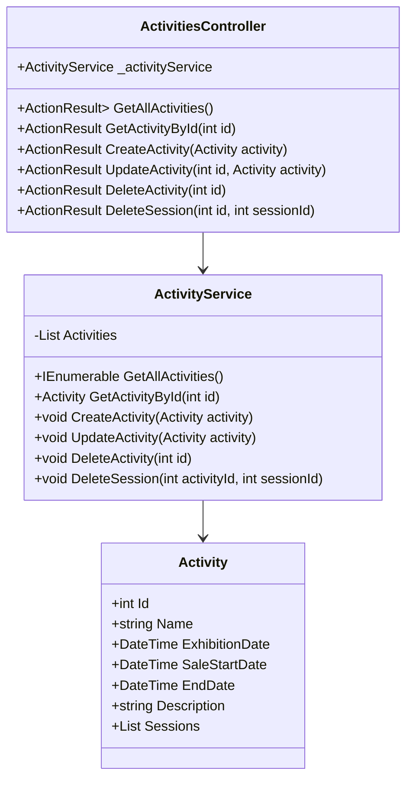

```mermaid
classDiagram
    class ActivitiesController {
        +ActivityService _activityService
        +ActionResult<IEnumerable<Activity>> GetAllActivities()
        +ActionResult<Activity> GetActivityById(int id)
        +ActionResult CreateActivity(Activity activity)
        +ActionResult UpdateActivity(int id, Activity activity)
        +ActionResult DeleteActivity(int id)
        +ActionResult DeleteSession(int id, int sessionId)
    }
    class ActivityService {
        -List<Activity> Activities
        +IEnumerable<Activity> GetAllActivities()
        +Activity GetActivityById(int id)
        +void CreateActivity(Activity activity)
        +void UpdateActivity(Activity activity)
        +void DeleteActivity(int id)
        +void DeleteSession(int activityId, int sessionId)
    }
    class Activity {
        +int Id
        +string Name
        +DateTime ExhibitionDate
        +DateTime SaleStartDate
        +DateTime EndDate
        +string Description
        +List<Session> Sessions
    }

    ActivitiesController --> ActivityService
    ActivityService --> Activity

    click ActivitiesController call linkCallback("/Users/klayhung/code/github/github-copilot-advanced-dev/Api1/Controllers/ActivitiesController.cs#L10")
    click ActivityService call linkCallback("/Users/klayhung/code/github/github-copilot-advanced-dev/Api1/Services/ActivityService.cs#L6")
    click Activity call linkCallback("/Users/klayhung/code/github/github-copilot-advanced-dev/Api1/Models/Activity.cs#L5")
```