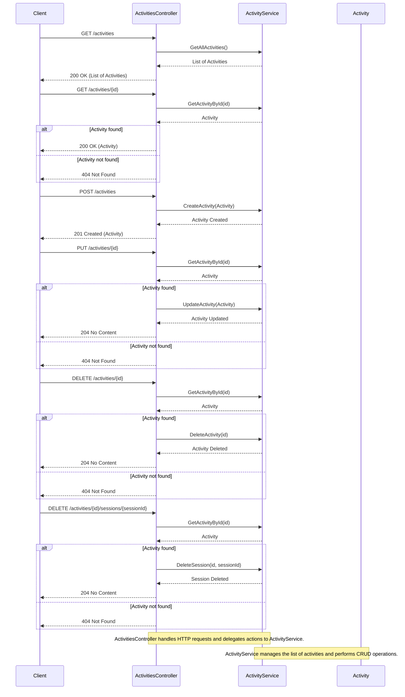

```mermaid
sequenceDiagram
    participant Client
    participant ActivitiesController
    participant ActivityService
    participant Activity

    Client->>ActivitiesController: GET /activities
    ActivitiesController->>ActivityService: GetAllActivities()
    ActivityService-->>ActivitiesController: List of Activities
    ActivitiesController-->>Client: 200 OK (List of Activities)

    Client->>ActivitiesController: GET /activities/{id}
    ActivitiesController->>ActivityService: GetActivityById(id)
    ActivityService-->>ActivitiesController: Activity
    alt Activity found
        ActivitiesController-->>Client: 200 OK (Activity)
    else Activity not found
        ActivitiesController-->>Client: 404 Not Found
    end

    Client->>ActivitiesController: POST /activities
    ActivitiesController->>ActivityService: CreateActivity(Activity)
    ActivityService-->>ActivitiesController: Activity Created
    ActivitiesController-->>Client: 201 Created (Activity)

    Client->>ActivitiesController: PUT /activities/{id}
    ActivitiesController->>ActivityService: GetActivityById(id)
    ActivityService-->>ActivitiesController: Activity
    alt Activity found
        ActivitiesController->>ActivityService: UpdateActivity(Activity)
        ActivityService-->>ActivitiesController: Activity Updated
        ActivitiesController-->>Client: 204 No Content
    else Activity not found
        ActivitiesController-->>Client: 404 Not Found
    end

    Client->>ActivitiesController: DELETE /activities/{id}
    ActivitiesController->>ActivityService: GetActivityById(id)
    ActivityService-->>ActivitiesController: Activity
    alt Activity found
        ActivitiesController->>ActivityService: DeleteActivity(id)
        ActivityService-->>ActivitiesController: Activity Deleted
        ActivitiesController-->>Client: 204 No Content
    else Activity not found
        ActivitiesController-->>Client: 404 Not Found
    end

    Client->>ActivitiesController: DELETE /activities/{id}/sessions/{sessionId}
    ActivitiesController->>ActivityService: GetActivityById(id)
    ActivityService-->>ActivitiesController: Activity
    alt Activity found
        ActivitiesController->>ActivityService: DeleteSession(id, sessionId)
        ActivityService-->>ActivitiesController: Session Deleted
        ActivitiesController-->>Client: 204 No Content
    else Activity not found
        ActivitiesController-->>Client: 404 Not Found
    end

    note over ActivitiesController,ActivityService: ActivitiesController handles HTTP requests and delegates actions to ActivityService.
    note over ActivityService,Activity: ActivityService manages the list of activities and performs CRUD operations.
```